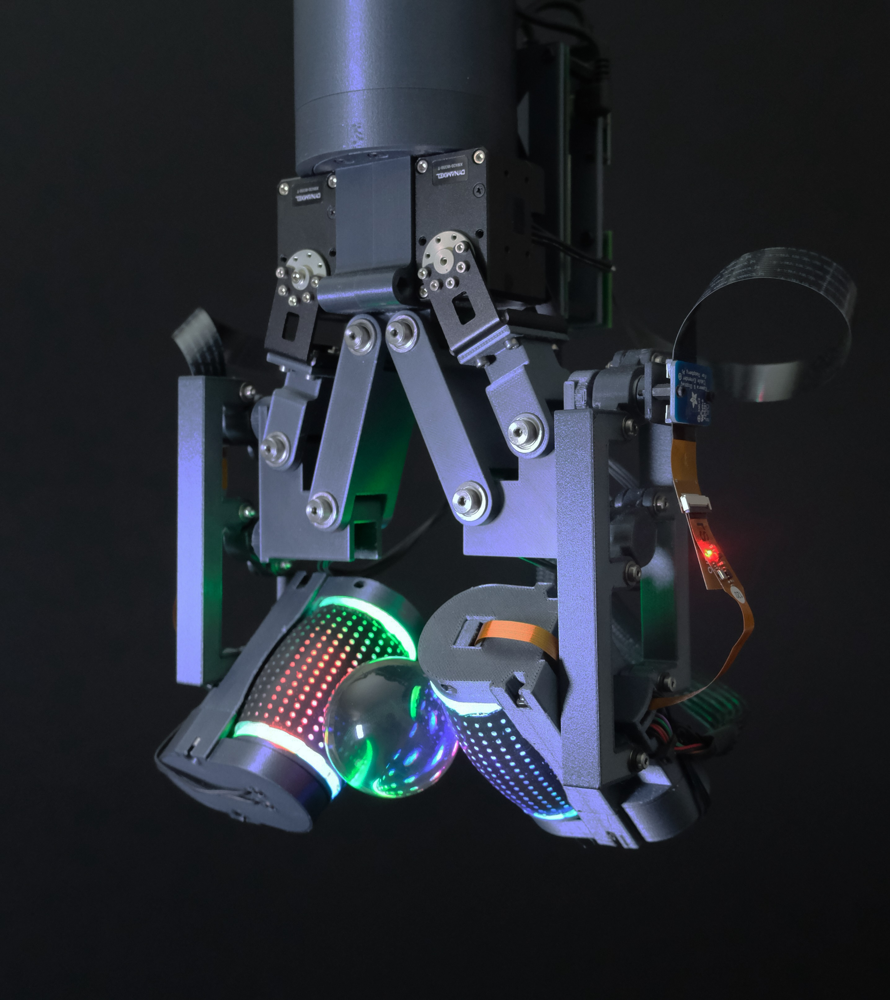
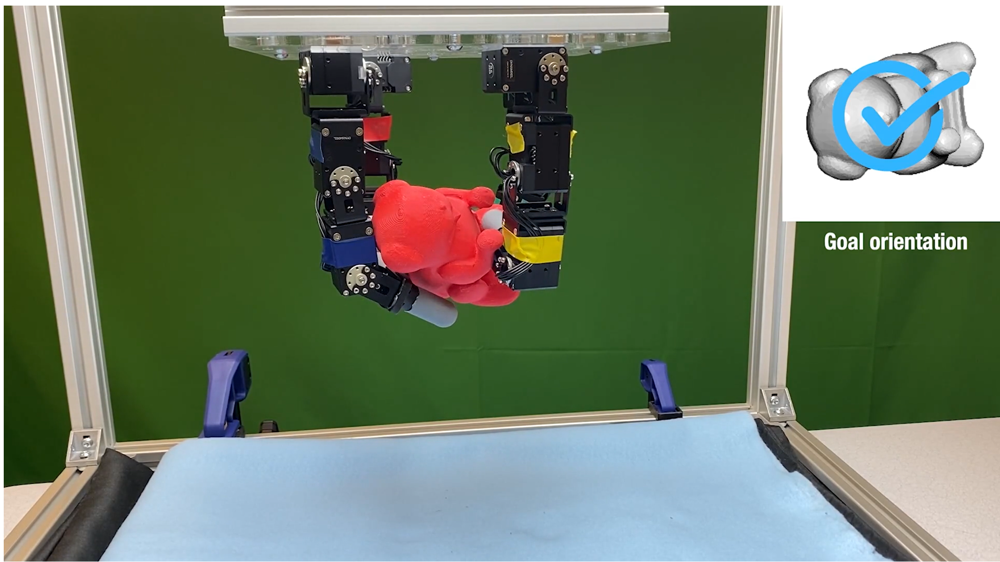
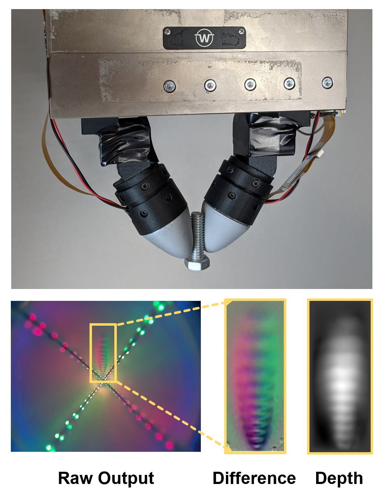
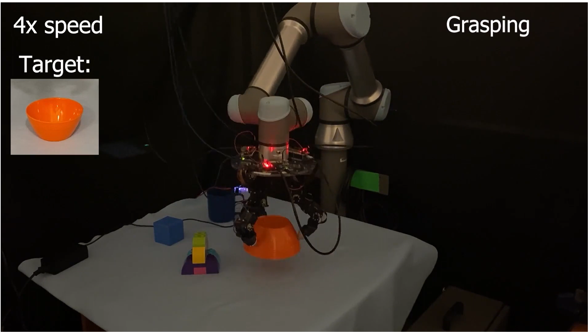
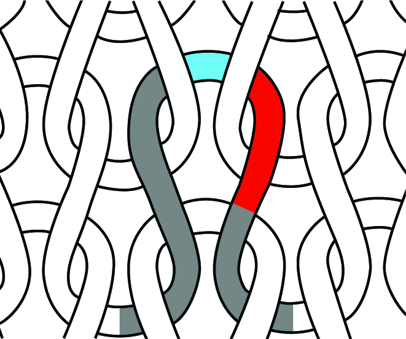

# Megha H. Tippur

[Email](mailto:mhtippur@mit.edu) \ [Google Scholar](https://scholar.google.com/citations?user=ucnPAUAAAAAJ&hl=en) \ [Resume](files/MeghaTippur_Resume.pdf)

I'm a PhD student at [MIT CSAIL](https://www.csail.mit.edu/) working with Professor Edward H. Adelson in the [Perceptual Science Group](https://persci.mit.edu/). My current research explores the development and use of tactile sensing to improve dexterous robotic manipulation. I have also had the opportunity to work with Professor Pulkit Agrawal ([Improbably AI Lab](https://people.csail.mit.edu/pulkitag/)). I am grateful to have been supported by the NSF Graduate Research Fellowship ([NSF GRFP](https://www.nsfgrfp.org/)) and the MIT MechE Chang-Mansfield Fellowship. 

Previously, I graduated from the Georgia Institute of Technology in Electrical Engineering. During my time there, I was fortunate enough to work on a variety of soft robotics and biomedical engineering projects, advised by Professor Frank Hammond III ([ARM Lab](https://armlab.gatech.edu/) at Georgia Tech), Professor Cynthia Sung ([GRASP Lab](https://sung.seas.upenn.edu/people/sung/) at UPenn), and Professor Robert Butera ([Neural Engineering Lab](https://bme.gatech.edu/bme/faculty/Robert-Butera) at Georgia Tech). I also spent time at NASA’s Jet Propulsion Laboratory (JPL) as a Caltech WAVE Fellow.
 
 

# Related Publications   #
## [Reactive In-Air Clothing Manipulation with Confidence-Aware Dense Correspondence and Visuotactile Affordance](https://mhtippur.github.io/web/#rainbowsight-a-family-of-generalizable-curved-camera-based-tactile-sensors-for-shape-reconstruction) ## 
Neha Sunil\*, **Megha Tippur\***, Arnau Portillo, Edward Adelson, Alberto Rodriguez  
*Under Review, Conference on Robot Learning (CoRL), 2025*  
[Paper](files/ClothFolding.pdf) 
(\* denotes equal contribution) 
 

  

## [RainbowSight: A Family of Generalizable, Curved, Camera-Based Tactile Sensors for Shape Reconstruction](https://ieeexplore.ieee.org/document/10609863) ##
<!--  -->
**Megha Tippur** and Edward H. Adelson  
*IEEE International Conference on Robotics and Automation (ICRA), 2024*  
[Paper](files/RainbowSight.pdf) \ [Paper Link](https://ieeexplore.ieee.org/document/10609863) \ [Project Page](https://mhtippur.github.io/rainbowsight/) 
 

  

## [Tactile-Reactive Roller Grasper](https://arxiv.org/abs/2306.09946) ##  

Shenli Yuan\*, Shaoxiong Wang\*, Radhen Patel, **Megha Tippur**, Connor Yako, Edward Adelson, Kenneth Salisbury  
*Transactions on Robotics (T-RO), 2025*  
[Paper](files/TactileReactive.pdf) \ [Paper Link](https://ieeexplore.ieee.org/document/10892188) \ [Project Page](https://yuanshenli.com/tactile_reactive_roller_grasper.html)  
 

## [Visual Dexterity: In-Hand Dexterous Manipulation from Depth](https://www.science.org/doi/10.1126/scirobotics.adc9244) ##

  

Tao Chen, **Megha Tippur**, Siyang Wu, Vikash Kumar, Edward Adelson, Pulkit Agrawal  
*Science Robotics, 2023*  
[Paper](files/VisualDexterity.pdf) \ [Paper Link](https://www.science.org/doi/10.1126/scirobotics.adc9244) \ [Project Page](https://taochenshh.github.io/projects/visual-dexterity)  

 

  

## [Gelsight360: An Omnidirectional Camera-Based Tactile Sensor for Dexterous Robotic Manipulation](https://ieeexplore.ieee.org/document/10122097) ##
**Megha Tippur** and Edward H. Adelson  
*IEEE International Conference on Soft Robots (RoboSoft), 2023*, **<ins>Best Paper Finalist</ins>** 
[Paper](files/Gelsight360.pdf) \ [Paper Link](https://ieeexplore.ieee.org/document/10122097)  

## [TactoFind: A Tactile Only System for Object Retrieval](https://taochenshh.github.io/projects/tactofind) ##

  

Sameer Pai\*, Tao Chen\*, **Megha Tippur\***, Edward Adelson, Abhishek Gupta, Pulkit Agrawal 
*IEEE International Conference on Robotics and Automation (ICRA), 2023* 
[Paper](files/TactoFind.pdf) \ [Paper Link](https://ieeexplore.ieee.org/document/10160289) \ [Project Page](https://taochenshh.github.io/projects/tactofind) 
(\* denotes equal contribution) 

## [Fabrication and Characterization of I-cord Knitted SMA Actuators](https://ieeexplore.ieee.org/document/9479207) ##

  

Christopher Kim, Athena Chien, **Megha Tippur**, Cynthia Sung  
*IEEE International Conference on Soft Robots (RoboSoft), 2021* 
[Paper](files/SMAActuators.pdf) \ [Paper Link](https://ieeexplore.ieee.org/document/9479207)